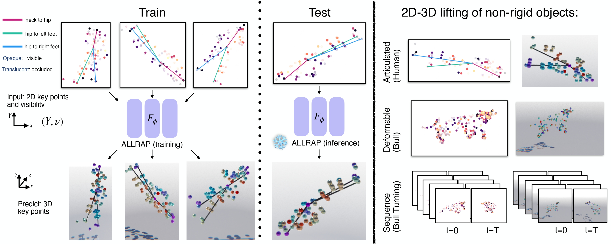
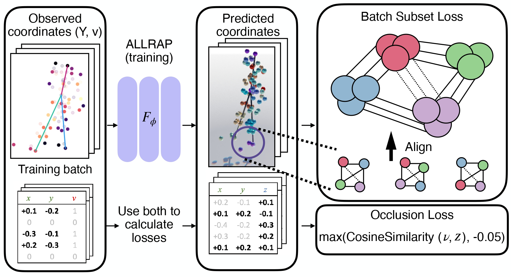

# Unsupervised 2D-3D lifting of non-rigid objects using local constraints

This repository contains a PyTorch implementation of the ALLRAP model and training lossses.

### 3D Reconstruction for partially-occluded 2D semantic keypoints.
With an orthographic camera model, for visible points ($v=1$) we know the screen coordinates $(x,y)$ and must predict only the depth $z$. For occluded points ($v=0$), we must predict all three $(x,y,z)$-coordinates. At test time, a trained deep network predicts the unknown coordinates. The network is generic, without any kind of low-rank constraints built-in; the geometric intuition is built into the losses during training. For a perspective camera model, the same process can be applied along the camera rays, rather than directly using the $x$-, $y$- and $z$-axes.



### Unsupervised losses
Starting from a randomly-initialized generic deep network, we iteratively learn from batches of partially-occluded 2D-annotated training samples. Our training use two unsupervised, batch-wise losses.
The subset loss, acts on the batch of noisy 3D reconstructions. It selects a subset of nearby keypoints, aligns the sub-shapes by rotation and translation, and finally measures the size of the non-rigid motion using the log-product of the  singular value decomposition of the residual error matrix, i.e. the log Gramian determinant. This encourages the model to predict body parts that are as consistent as possible. The occlusion loss,  encourages a weak negative correlation between the binary keypoint-visibility annotations and the predicted depths. This uses the fact that visible keypoints often hide other keypoints because they are closer to the camera.}


## Prerequisites

PyTorch, PyTorch3D, timm, faiss-gpu

## Dataset
1. Go to https://github.com/rabbityl/DeformingThings4D.
2. Fill out the google form.
3. Once approved, please download the and unzip the raw animations folder.
4. Go to the file data/process_df4d.py and add the path in BASE_DIR and output_dir to
    path to the downloaded folder and desired output, respectively.
5. Run 
```
    python data/process_data.py
```

## Training on S-Up3D

Run
```
python experiment_sup3d.py
```

## Training on DeformingThings4D
1. Go to https://github.com/rabbityl/DeformingThings4D.
2. Fill out the google form.
3. Once approved, please download the and unzip the raw animations folder.
4. Go to the file data/process_df4d.py and add the path in BASE_DIR and output_dir to path to the downloaded folder and desired output, respectively.
```
python data/process_data.py
```
5. Select the correct enum {1: Bull, 2:Fox ..} and run
python experiment_df4d.py 1
See the [CONTRIBUTING](CONTRIBUTING.md) file for how to help out.

## License
See the [LICENSE](./LICENSE) file for details about the license under which this code is made available.

## Citation
If you find our paper and code useful in your research, please consider giving a star ⭐ and citation 📝 :)

```
@inproceedings{maiti2025unsupervised2d3dliftingnonrigid,
  title={Unsupervised 2D-3D lifting of non-rigid objects using local constraints},
  author={Maiti, Shalini and Agapito, Lourdes and Graham, Benjamin},
  maintitle={CVPRv},
  booktitle={Workshop on 4D Vision: Modeling the Dynamic World, In conjunction with CVPR 2025},
  year={2025}
}
```