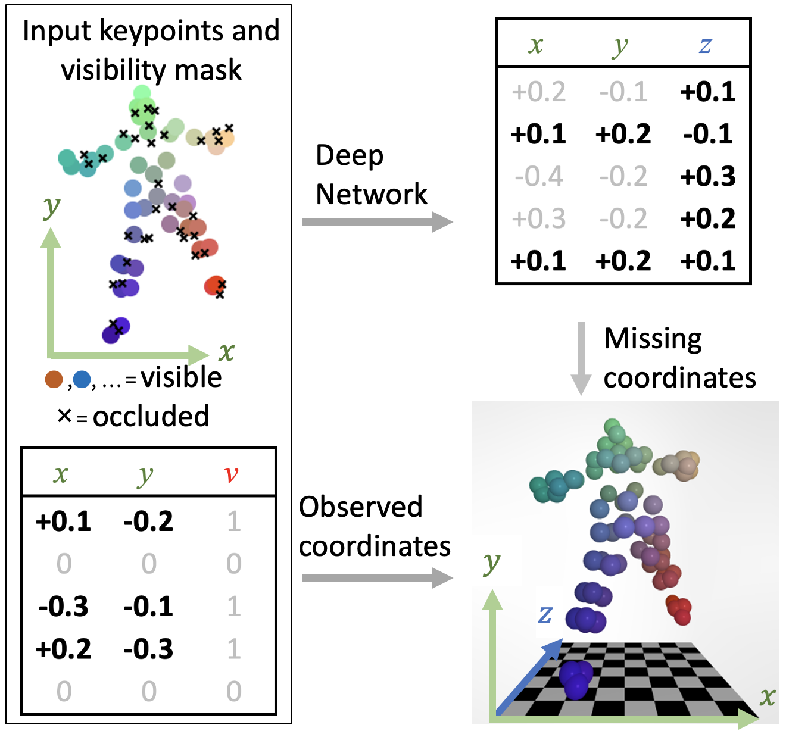
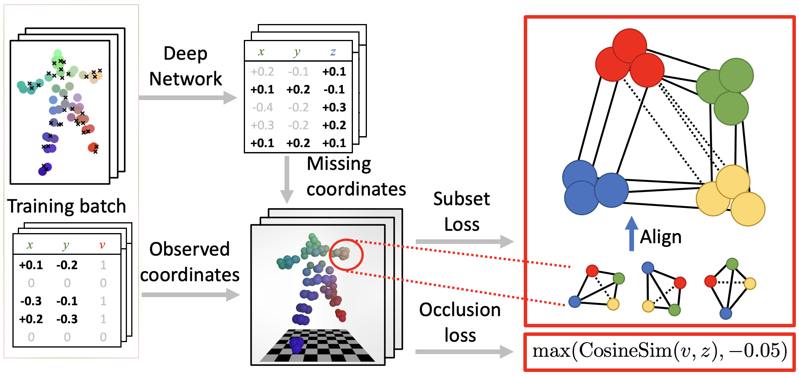

# Unsupervised 2D-3D lifting of non-rigid objects using local constraints
## Supplementary material for submission 106

This repository contains a PyTorch implementation of the ALLRAP model and training lossses.

### 3D Reconstruction for partially-occluded 2D semantic keypoints.
With an orthographic camera model, for visible points ($v=1$) we know the screen coordinates $(x,y)$ and must predict only the depth $z$. For occluded points ($v=0$), we must predict all three $(x,y,z)$-coordinates. At test time, a trained deep network predicts the unknown coordinates. The network is generic, without any kind of low-rank constraints built-in; the geometric intuition is built into the losses during training, see Figure~\ref{fig:splash}. For a perspective camera model, the same process can be applied along the camera rays, rather than directly using the $x$-, $y$- and $z$-axes.



### Unsupervised losses
Starting from a randomly-initialized generic deep network, we iteratively learn from batches of partially-occluded 2D-annotated training samples. Our training use two unsupervised, batch-wise losses.
The subset loss, see Section \ref{sec:tuple_loss}, acts on the batch of noisy 3D reconstructions. It selects a subset of nearby keypoints, aligns the sub-shapes by rotation and translation, and finally measures the size of the non-rigid motion using the log-product of the  singular value decomposition of the residual error matrix, i.e. the log Gramian determinant. This encourages the model to predict body parts that are as consistent as possible. The occlusion loss, see Section \ref{sec:occlusion},  encourages a weak negative correlation between the binary keypoint-visibility annotations and the predicted depths. This uses the fact that visible keypoints often hide other keypoints because they are closer to the camera.}


## Training on S-UP3D

Run
```
python sup3d.py
```

